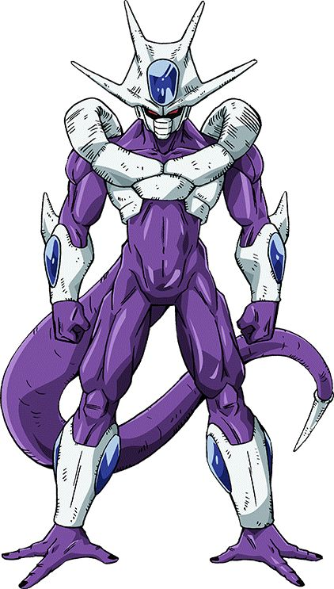
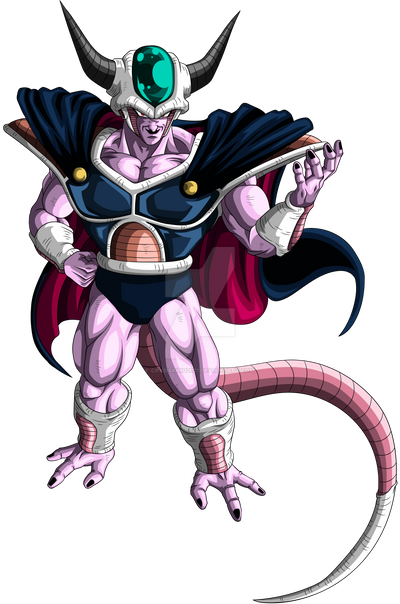

# Html


Ejercicio 2
```html
<!--Listas-->

<!--Listas con símbolo seleccionado-->
    <ol type="i">
        <li>Primavera</li>
        <li>Verano</li>
        <li>Otoño</li>
    </ol>

<!--Listas ordenada-->
    <ol>
        <li>Primavera</li>
        <li>Verano</li>
        <li>Otoño</li>
    </ol>

<!--Listas desordenadas-->
    <ol reversed>
        <li>Primavera</li>
        <li>Verano</li>
        <li>Otoño</li>
    </ol>

<!--Listas con número inicial-->
    <ol start="10">
        <li>Primavera</li>
        <li>Verano</li>
        <li>Otoño</li>
    </ol>

<!--Listas con símbolo-->
    <ul>
        <li>Primavera</li>
        <li>Verano</li>
        <li>Otoño</li>
    </ul>

<!--Listas con círculo-->
    <ul type="circle">
        <li>Primavera</li>
        <li>Verano</li>
        <li>Otoño</li>
    </ul>

<!--Listas con cuadrado-->
    <ul type="square">
        <li>Primavera</li>
        <li>Verano</li>
        <li>Otoño</li>
    </ul>
    <hr />

<!--Detalles-->
    <details open>
        <summary>Resumen del detalle</summary>
        <h1>Hola es un encabezado</h1>
        <p>
            Lorem ipsum dolor sit amet, consectetur adipisicing elit. Fugit tenetur perspiciatis cupiditate omnis quidem tempore dolorem ex libero deserunt? Minus minima iure eum totam nam quis earum cumque voluptatum. Quo.
        </p>
    </details>
```

Ejercicio 3
```html
<!-- Creación de tabla -->

table>tr*3>td*3

<!-- Colocación de bordes en la tabla -->
<table border="1">
```
Ejercicio 4
```html
<!-- Colocación de imagen con medida en píxeles -->


<!-- Colocación de imagen con medida porcentaje -->


<!-- Etiqueta comodin. Agrupar -->

    <div>
        Este es un alien</p>
    </div>
<!-- Figura etiqueta semantica -->
    <figure>
        <div>
            
        <figcaption>Este es un alien</figcaption>
    </figure>

<!-- Enlaces -->
     <a href="https://latam.ign.com/dragon-ball-z-1/74914/news/dragon-ball-z-por-que-king-cold-nunca-resucito">Ms</a>
     ```